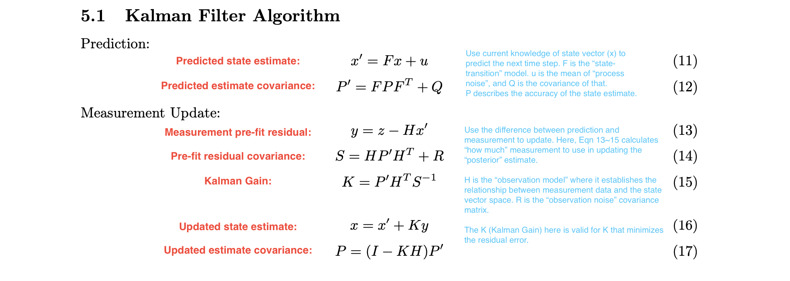
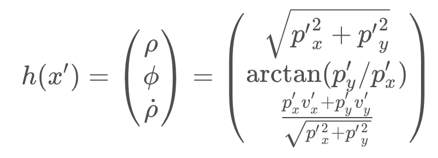

# Lesson 21~24: Kalman Filter

## Class Notes

### 1. Intro to Kalman Filter

- Resources - Wikipedia (very concise derivations): [Kalman Filter](https://en.wikipedia.org/wiki/Kalman_filter)
- Resources - iLectureOnline (detailed lectures): [Lectures in The Kalman Filter](http://www.ilectureonline.com/lectures/subject/SPECIAL TOPICS/26/190)
- Marked Equation:

### 2. Kalman Filter Algorithm

- **Overview of the Kalman Filter Algorithm Map:**

  

- **Two-step estimation: Prediction & Update**
  - One-sensor scenario: with the distribution of current state, predict the future step; and then when new measurement is received, update the prediciton with the new measurement/observation.
  - Multiple-sensor scenario: similar to one sensor, but sensor measurements may return at a different timestep, in this case, the prediction is updated asynchronically.

- **Kalman Filter Equations in C++ (Simplified Case):**

  - See `L24U7_KalmanFilter1D.cpp` for example.

- **Process Covariance Matrix:**

  - Modeling the acceleration as a process noise factor here
  - Read the full derivation to the 4x4 Q matrix in `sensor-funsion-ekf-reference.pdf`.

### 3. Lidar and Radar Measurements:

- **Comparisons:**

  | Features              | Lidar     | Radar |
  | --------------------- | --------- | ----- |
  | Wavelength            | Infrared  | mm    |
  | Line-of-Sight Only?   | Yes       | No    |
  | Can Measure Velocity? | No        | Yes   |
  | Resolution            | High      | Low   |
  | Coordinate System     | Cartesian | Polar |

- **Lidar Measurements:**

  - See `L24U13_LaserMeasurements.cpp` for example.

- **Radar Measurements:**

  - Radar measurement works in polar coordinates, so the H matrix from Lidar measurements (that maps the state vector `x = (p, v)`, in Cartesian coordinates to the polar coordinates) doesn't exist any more. Instead, it's a non-linear function that transforms the vector:

    

  - Kalman Filter is not applicable any more: the update function uses Gaussian distribution, but with the non-linear function applied, the output is no longer Gaussian.

  - Solution: linearize the non-linear function by performing a first-order Taylor Expansion.

### 4. Extended Kalman Filter:

- To ultilize Kalman Filter even on non-linear functions, the non-linear function can be approximated as its Taylor Expansion (because the difference in IV is small).

- Now, the function can be expressed as:

  `h(x) = h(mu) + d (h(mu)) / dx * (x-mu) = h(mu) + H*(x-mu)`

  here, the H matrix is the Jacobian matrix for function h(x) at all components and all IVs.

- **Generalization of EKF:** the EKF equations are much the same as standard KF equation, except for:

  - In prediciton step `P' = F * P * F_transpose + Q`, the `F` matrix will be replaced by `F_jacobian`.
  - In update step, when calculating `S`, `K`, and `P`, the `H` matrix will be replaced by `H_jacobian`.

  **Note that**, these are NOT changing to the Jacobian matrix, but the non-linear functions:

  - In prediction step `x' = F * x + u`, the `F` matrix will be replaced by the non-linear f function: `x' = f(x) + u`.
  - In update step `y = z - H * x'`, the the `H` matrix will be replaced by the non-linear h function: `y = z - h(x')`.

- **Evaluating KF Performance:** the most frequently used matrics is RMSE (root mean squared error):

  `RMSE = sqrt (1/n * SUM (x_est - x_true)^2)`
