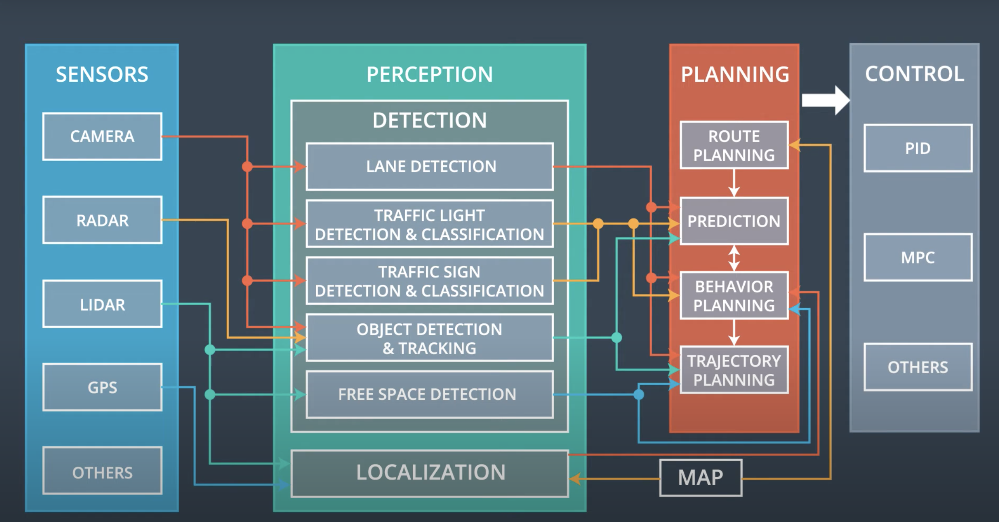

# Lesson 14: Automonous Vehicle Architecture

## Class Notes

- Sensor Subsystem
- Perception Subsystem
  - Detection: utilize camera, lidar, radar etc. to process and understand the surrounding environment: lane detection, traffic light, traffic sign, object, free space, etc.
  - Localization: uttilize lidar and map data to understand the AV's position.
- Planning Subsystem
  - Route planning - long range plan using map data;
  - Prediction - tracking and predicting nearby obstacles and traffic;
  - Behavior planning - what the AV should do;
  - Trajaectory planning - the exact path the AV should follow
- Control Subsystem