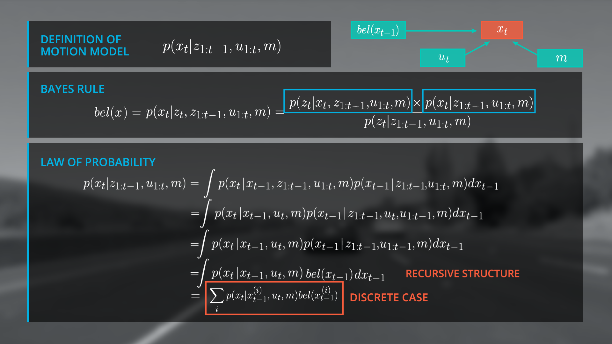
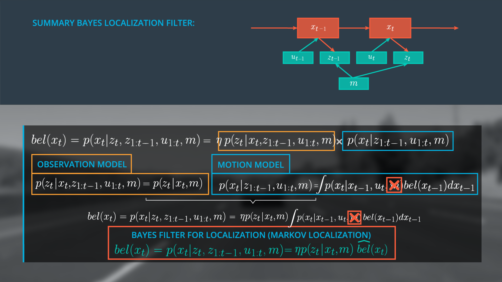

# Lesson1~2: Localization

## Class Notes

### 1. Introduction to Localization 

- The key to localization is to use information (sensors, GPS, maps, etc.) to update the probability of where the vehicle might be.

- Localization problem: move and sense - when moving, we lose information; when sensing, we gain information.
  - Move: convolution of the existing probability with the motion defined.
  - Sense: updating the probability by multiplying with "measurement" confidence, then followed by normalization. 
  
 - The localization problem is all about calculating`bel(x_t) = p(x_t|z_1:t, u_1:t, m)`, 

   where: 

   - `x_t` is the location of object
   - `z` is the array of measurement
   - `u` is the array of motion
   - `m` is the map, here we assume the map is constant. If no map available, it is SLAM (Simultaneous Localization and Mapping) - much more complicated.

### 2. Generalized Bayes Rule

- In Bayesian Filter language, the localization problem is:

  `P(a|b) = P(b|a)  * P(a) / P(b)`

  where,

  - `P(a|b)`, i.e. `P(location|observation`, is the **normalized** probability of a position given an observation (posterior).
  - `P(b|a)` , i.e. `P(observation|location`, is the probability of an observation given a position (likelihood).
  - `P(a)`, i.e. `P(location)`, is the prior probability of a position.
  - `P(b)`, i.e. `P(observation)`, is the total probability of an observation.

- **Traditional Posterior Fomulation:**

  - Objective: to reduce the amount of data to compute at each step - as the equation suggests, the measurement from very beginning to the current timestep needs to be taken into account, this could mean a large quantity of data that the system cannot handle.

  - Approach: demonstrate that our current belief `bel(x_t)` can be expressed by the belief one step earlier `bel(x_t-1)`, then use new data to update only the current belief.

  - Derivation: apply Bayes rule,

    ```markdown
    bel(x_t) 	= p(x_t|z_1:t, u_1:t, m)
    					= p(x_t|z_t, z_1:t-1, u_1:t, m)
    					= p(z_t|x_t, z_1:t-1, u_1:t, m) * p(x_t|z_1:t-1, u_1:t, m) 
    							/ p(z_t|z_1:t-1, m)
    ```

   - Break-down:

      - Posterior = L.H.S. of equation
      - Likelihood term = **Observation model:** `p(z_t|x_t, z_1:t-1, u_1:t, m)`, describes the probability distribution of the observation vector
      - Prior term = **Motion model:** `p(x_t|z_1:t-1, u_1:t, m)`, describes the probability distribution of x_t given all observations from 1 to t-1.
      - Normalization term = total probability, it is the sum of each likelihood term multiplied by prior term.
  

### 3. Simplify Bayes Rule with Markov Assumption
- **Markov Assumption:**

  - A Markov process is one in which the conditional probability distribution of future states (ie the next state) is dependent only upon the current state and not on other preceding states. 

    It is important to note that the current state may contain all information from preceding states. 

 - Recursive Structure for **Motion Model:**

    
    
    - Discretized Motion Model:
    
      ​	∑*p*(*x**t*∣*x**t*−1(*i*),*u**t*,*m*)*b**e**l*(*x**t*−1(*i*))
    
    - Transition Model:
    
      ​	*p*(*x**t*∣*x**t*−1(*i*),*u**t*,*m*)
    
 - Recursive Structure for **Observation Model:** 

### 4. Bayes Filter for Localization (Markov Localization)

With all above derivations put together, we get the Markov Localization formula:



- The motion model describes the prediction step of the filter while the observation model is the update step.
- The state estimation using the Bayes filter is dependent upon the interaction between prediction (motion model) and update (observation model steps) and all the localization methods discussed so far are realizations of the Bayes filter.