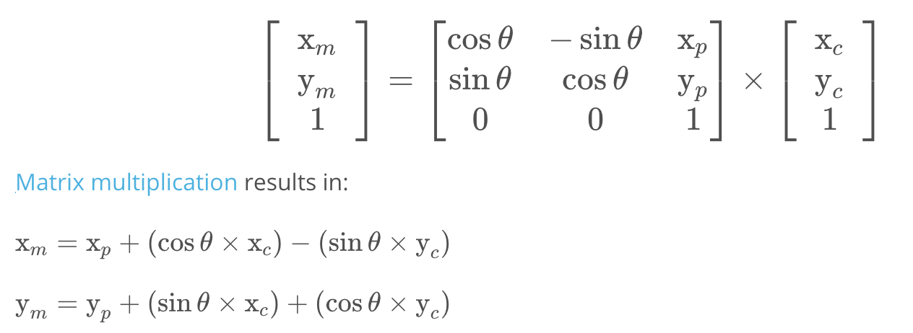

# Lesson 3~5: Motion Models, Particle Filter

## Class Notes

### 1. Bicycle Model

- Assumptions: the front wheels and rear wheels are connected rigidly, and the vehicle does not have vertical movement.
- Yaw, roll and pitch:
  - Yaw is the angular (steering) motion of a vehicle on Z-axis;
  - Roll and pitch is along the x and y axes, respectively, however, they are sometimes neglible (if the world is flat enough)
- Odometry:
  - Using wheel encoder to estimate vehicle longitudinal travel.
  - Less-accurate cases:
    - Slippery road
    - Bumpy road - tire circumference change

### 2. Particle Filters

|                   | State Space | Belief     | Efficiency  | In Robotics |
| ----------------- | ----------- | ---------- | ----------- | ----------- |
| Histogram Filters | Discrete    | Multimodal | Exponential | Approximate |
| Kalman Filters    | Continuous  | Unimodal   | Quadratic   | Approximate |
| Particle Filters  | Continuous  | Multimodal | ???         | Approximate |

- Particle Filter Concept:

  - Randomly generate particles that fills the space (candidates).
  - Let the particles "sense" just as the actual vehicle senses.
  - Compare the measurement results of the particles against the actual vehicle measurement, this "comparison result" is also called "importance weight".
  - Resample the particles by the importance weight calculated in previous step.
  - Continue to repeat the steps above and the particles will eventually converge to the most likely location of the vehicle.

- Code Implementation for "Weighted Resample"

  ```python
  # inputs:
  # p - this is an array of "particles"
  # N - this is the number of "particles"
  # w - this is an array of weights corresponding to each particle
  
  p3 = []
  index = int(random.random() * N)
  beta = 0.0
  mw = max(w)
  for i in range(N):
    beta += random.random() * 2.0 * mw
    while beta > w[index]:
      beta -= w[index]
      index = (index + 1) % N
    p3.append(p[index])
  ```

### 3. Implementing Particle Filter

Flowchart:


Step-by-Step Guide:

- **Initialization:** use the GPS location to help minimize the number of particles

  - Particles shall be implemented by sampling a Gaussian distribution, taking into account Gaussian sensor noise around the initial GPS position and heading estimates.

- **Precition:** use motion model to predict the vehicle location at next timestep.

- **Update:** 

  - Data association (matching map landmark with measurements): here we use "nearest neighbor" method, i.e. the closest measurement will be associated. It is easy to understand and implement; but it is less efficient to calculate, and it's less robust. 

  - Homogeneous transformation: translate the observation from vehicle (in vehicle coordinates) to a real-world coordinates:

    

  - Calculate the particle weight: use multivariate guassian distribution to model the weights for a particle (with x and y position errors to the landmark).

    ```c++
    #include "multiv_gauss.h"
    #include <cmath>
    
    double multiv_prob(double sig_x, double sig_y, double x_obs, double y_obs, double mu_x, double mu_y) {
      // calculate normalization term
      double gauss_norm;
      gauss_norm = 1 / (2 * M_PI * sig_x * sig_y);
    
      // calculate exponent
      double exponent;
      exponent = (pow(x_obs - mu_x, 2) / (2 * pow(sig_x, 2)))
                   + (pow(y_obs - mu_y, 2) / (2 * pow(sig_y, 2)));
        
      // calculate weight using normalization terms and exponent
      double weight;
      weight = gauss_norm * exp(-exponent);
        
      return weight;
    }
    ```

  - 